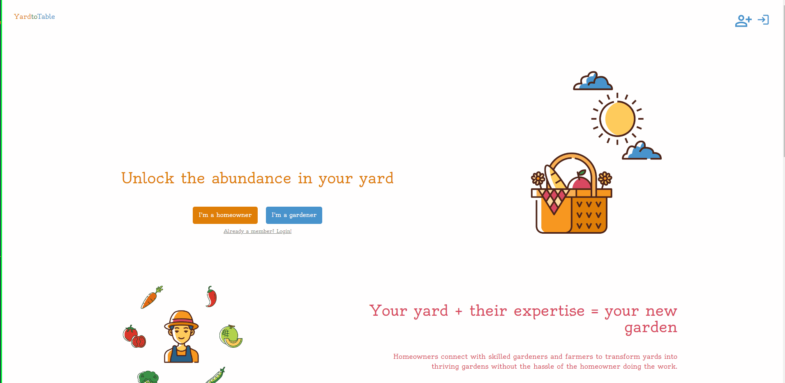

# Yard to Table [](https://opensource.org/licenses/MIT)

## Table of Contents
- [Project Description](#project-description)
- [Visuals](#visuals)
- [Installation](#installation)
- [License](#license)
- [Contributing](#contributing)
- [Roadmap](#future-development-roadmap)
- [Authors and Acknowledgment](#authors-and-acknowledgment)

## Project Description
* Yard to Table is a web application that allows users to get their lawns refurbished from professional agriculturilst. Users can create an account, post informations about their lots, and find the perfect gardener for their home. Users can also view their order history and update their account and plot information.

## Visuals
Live Link:

[](https://hidden-beyond-87879-91f0e9d6f69e.herokuapp.com/)

## Installation
* To install this application, clone the repository to your local machine. Once cloned, navigate to the root directory of the repository and run `npm install` to install all dependencies. You will also need to create a `.env` file in the root directory and add the following variables:
```
MONGODB_URI=mongodb://localhost/yard-to-table
JWT_SECRET=your-secret

```
* You will need to create a Stripe account and add your Stripe secret key to the `.env` file. You will also need to create a MongoDB database and add the URI to the `.env` file. Once these steps are complete, run `npm start` to start the application.

## License
* This application is covered under the [MIT](https://choosealicense.com/licenses/mit/) license.

## Contributing
1. Fork the repository and clone it to your local machine.
2. Create a new branch for your feature or bug fix.
3. Make your changes and commit them to your branch.
4. Push your changes to your forked repository.
5. Open a pull request to the original repository, and describe your changes and why they are necessary.


## Future Development Roadmap

1. Connect Homeowners to Gardeners with an in app messaging system
2. Add a calendar to the dashboard to show upcoming appointments
3. Add a map to the dashboard to show the location of the gardener
4. Add a rating system for Gardeners to rate Homeowners
5. Add a payment system for Gardeners to receive depost payments to avoid no payments after service
6. Ability to signup as both a homeowner and a gardener


## Authors and acknowledgment
* Matt Turner [GitHub](https://github.com/maaront "GitHub Profile")
* Jeff Zenko [GitHub](https://github.com/codemodeactivate "GitHub Profile")
* Jake Krieger [GitHub](https://github.com/jkrieger6 "GitHub Profile")
